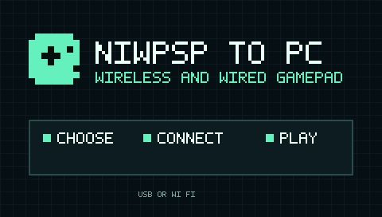

# niwPSPtoPC

**The Ultimate Wireless and Wired Gamepad for PSP and Windows.**

niwPSPtoPC turns a Sony PSP into an Xbox 360 controller for Windows over a USB
data cable or Wi-Fi. Both transports use the same input protocol, safety
handling and virtual-gamepad mapping. USB connects automatically without a
pairing code; Wi-Fi uses a five-character code and automatic local-network
discovery.

Version 1.2.0 promotes the wired transport to a supported feature after
successful physical testing on a PSP-2004, including USB and Wi-Fi input,
hot-plugging and switching between both transports without restarting either
application.

Current release: **1.2.0**. See the
[complete 1.2.0 release notes](docs/releases/1.2.0.md) and
[changelog](CHANGELOG.md).



## Features

- automatic PC discovery — no IP address configuration;
- five-character Wi-Fi pairing code generated on every PSP launch;
- exclusive control for the first paired PSP;
- virtual Xbox 360 controller through ViGEmBus;
- live pixel-art input view on Windows;
- graphical PSP interface and custom XMB icon/background;
- automatic PSP Wi-Fi reconnect and PC rediscovery after an AP outage;
- large USB/Wi-Fi selector on the PSP, with unavailable Wi-Fi disabled when
  the WLAN switch is off;
- in-app USB/Wi-Fi switching without restarting either application
  or recreating the virtual controller;
- automatic Microsoft-signed WinUSB binding on Windows 10/11, with a
  one-time-per-device-instance UAC self-repair when Windows omits the
  application interface;
- large USB/Wi-Fi selector in the Windows application with transport-specific
  setup instructions and no pairing form after connection;
- automatic PSP backlight shutoff after a stable controller connection;
- stale, duplicate and out-of-order packets never roll input back;
- automatic neutral input after 0.5 seconds of silence without unplugging the
  virtual controller;
- automatic PSP session release after 1.75 seconds without fresh input;
- Connection Doctor 2.0 with Windows interfaces, profile/firewall checks,
  live UDP health and a copyable report;
- editable UDP bind, port and PSP IP allowlist settings;
- recoverable virtual-gamepad preflight without restarting the receiver;
- PSP readiness confirmation only after the virtual gamepad is available;
- no jitter buffer, keeping controller input as fresh as possible.

The physical PSP provides one analog stick, a D-pad, four face buttons, L/R,
Start and Select. A second analog stick and analog triggers cannot be emulated
because the console does not have those inputs.

## Requirements

### PSP

- a PSP-1000, PSP-2000, PSP-3000 or PSP Go with CFW and homebrew support;
- for USB: a compatible PSP data cable;
- for Wi-Fi: one working saved infrastructure Wi-Fi profile, a compatible
  2.4 GHz network, and the PSP and PC on the same local network.

PSP Street/E1000 has no Wi-Fi hardware. USB-only operation is expected, but
that model has not yet been physically verified and is not included in the
1.2.0 tested-hardware claim.

For cable-mode setup, Windows driver details and troubleshooting, see
[`docs/usb.md`](docs/usb.md).

### PSP network compatibility

niwPSPtoPC uses the PSP system network APIs and does not depend on the Wi-Fi
encryption method itself. Once the PSP connects successfully, receives an IPv4
address and can reach the PC on the same local network, the program works
normally.

Standard firmware and older CFW configurations generally require a legacy
WPA-PSK-compatible 2.4 GHz network. Recent
[ARK-4](https://github.com/PSP-Archive/ARK-4) and ARK-5 CFW releases include
WPA2 support, so niwPSPtoPC can also be used on a compatible 2.4 GHz WPA2-PSK
network. Configure and test the Wi-Fi connection in the PSP network settings
before starting the program. WPA3-only networks remain unsupported by the PSP.

> [!WARNING]
> If your firmware requires legacy WPA-PSK, use a dedicated access point or
> isolated SSID with no access to sensitive devices or data. Make sure
> PSP-to-PC peer traffic is allowed: many guest networks enable client
> isolation and therefore cannot carry niwPSPtoPC traffic. Do not weaken the
> security of your primary home network solely to use this software.

### Windows

- Windows 10 or 11, x64;
- [ViGEmBus](https://github.com/nefarius/ViGEmBus/releases/tag/v1.22.0)
  installed;
- inbound UDP port 47999 allowed on private networks.

ViGEmBus was retired by its maintainers in 2023 and is no longer developed.
niwPSPtoPC uses its final signed Windows 10/11 release because it remains the
backend required by `vgamepad`.

## Installation

1. Download both release archives from the latest GitHub Release.
2. Install ViGEmBus on the Windows PC.
3. Extract the Windows archive and start `niwPSPtoPC.exe`.
4. Extract the PSP archive and copy the complete `niwPSPtoPC` directory to
   Memory Stick storage:

   ```text
   ms0:/PSP/GAME/niwPSPtoPC/
   ```

   On a PSP Go using internal storage, use
   `ef0:/PSP/GAME/niwPSPtoPC/` instead.

5. Start **niwPSPtoPC** from the PSP Game menu.
6. Select **USB** or **WIFI** with LEFT/RIGHT and confirm with CROSS.
7. For USB, connect the data cable; no code is required.
8. For Wi-Fi, select a saved profile, select the large **Wi-Fi** field in the
   Windows app, and enter the five-character code shown on the PSP.
9. When both screens show a connected controller, start the game.

The PSP discovers the PC automatically. `config.ini` is loaded next to the
EBOOT on either `ms0:` or `ef0:`. If it is missing, safe defaults are used.
The optional send rate is limited to 15–60 Hz and is shown accurately in both
interfaces.

Hold **L+R+START** for 0.75 seconds while connected to return to the PSP
connection selector. Select the other large transport field in the Windows
app when preparing a switch. CIRCLE returns to the PSP selector while USB is
waiting for a cable or Wi-Fi is selecting/reconnecting. Removing the USB cable
also returns to the selector instead of closing the PSP application.

The PSP backlight turns off ten seconds after pairing to reduce battery use.
Press SCREEN or HOME to restore it. It is also restored automatically when the
connection is lost or the application closes. Press HOME to close the PSP
client.

## Windows firewall

Connection Doctor shows `port bound`, `datagram received`, `valid packet`,
`auth ready`, `ACK sent`, and `gamepad created`. It also queries active IPv4
interfaces, network profiles and the matching Windows firewall rule. If it
stops at `port bound` in Wi-Fi mode, check the Windows Private network profile,
firewall, matching UDP port, client isolation and whether broadcast traffic
can reach the PC interface. USB does not use the pairing code or UDP path.

Windows normally asks for private-network access on first launch. If it does
not, run this command in an administrator PowerShell:

```powershell
New-NetFirewallRule -DisplayName "niwPSPtoPC UDP" `
  -Direction Inbound -Action Allow -Protocol UDP -LocalPort 47999 `
  -Profile Private
```

Do not forward this port on a router and do not expose it to the Internet.

## Building from source

### PSP

Install [PSPDEV/PSPSDK](https://pspdev.github.io/installation.html), then:

```bash
export PSPDEV=/actual/path/to/pspdev
export PATH="$PSPDEV/bin:$PATH"
./scripts/build-psp.sh
./scripts/package-psp.sh
```

The Memory Stick package is written to `dist/niwPSPtoPC/`.

The release uses non-blocking controller peeks in the sender. For physical
latency/short-press A/B measurements, build the comparison variant with
`make -C psp-client SENDER_INPUT_MODE=read`; the default is
`SENDER_INPUT_MODE=peek`.

The native XMB assets can be reproduced without third-party Python packages:

```bash
python scripts/generate-psp-assets.py
```

### Windows

Install Python 3.12 or newer and run:

```powershell
.\scripts\build-windows.ps1
```

The standalone executable is written to
`dist/windows/niwPSPtoPC.exe`. Python is not required on the target PC.

To run the GUI directly from source:

```powershell
cd pc-server
python -m pip install -e ".[windows]"
python -m pc_server.gui
```

### Release archives

The release command runs tests, rebuilds both applications with the pinned
PSPDEV revision (Docker image or matching WSL toolchain), smoke-tests the EXE,
validates versions/freshness and verifies the resulting archives:

```powershell
.\scripts\package-release.ps1
```

This creates the two public ZIP archives and `SHA256SUMS.txt` under
`dist/release/`. Tagged `vX.Y.Z` builds are independently rebuilt and
published by the Release workflow using the matching document from
`docs/releases/`; branch CI ignores tags.

## Diagnostics and tests

The GUI includes compact connection diagnostics and a detailed Connection
Doctor for network, pairing, packet-health and driver failures. The
command-line tools remain available for extended runs:

```powershell
cd pc-server
python -m pc_server --host 0.0.0.0 --port 47999
python -m pc_server.simulator --token ABCDE
python -m pc_server.soak --minutes 30 --pairing-token ABCDE `
  --output hardware-soak.json
```

Run the complete automated suite with:

```bash
./scripts/build-pc.sh
```

The suite covers the shared C/Python golden packet, pairing ACK, real UDP
loopback, client selection, duplicate and out-of-order filtering, controller
timeout, Xbox 360 mapping, GUI state and PSP XMB assets.

The wire format is documented in
[docs/input-protocol.md](docs/input-protocol.md).

## Security

The Wi-Fi pairing code is designed for a trusted home LAN. Input packets are not
encrypted, and the token is visible to another device capable of capturing
traffic on that LAN. The protocol must not be exposed directly to the
Internet.

USB authorization relies on the physical cable and the local WinUSB device
instead of the typed code. It does not make a remote network transport trusted.

When using legacy WPA-PSK, run the PSP on a dedicated access point or isolated
SSID, allow peer-to-peer traffic between the PSP and PC, and do not place
trusted or sensitive devices on that network. WPA2 support provided by recent
ARK-4 and ARK-5 CFW releases avoids the need to enable legacy WPA solely for
niwPSPtoPC. Regardless of Wi-Fi encryption, use the application only on a
trusted local network.

See [SECURITY.md](SECURITY.md) for reporting security issues.

## License and trademarks

The project is distributed under the [MIT License](LICENSE). Third-party
components and notices are listed in
[THIRD_PARTY_NOTICES.txt](THIRD_PARTY_NOTICES.txt).

niwPSPtoPC is an independent homebrew project and is not affiliated with or
endorsed by Sony Interactive Entertainment, PlayStation, Microsoft or the
ViGEm project. PSP, PlayStation and Xbox are trademarks of their respective
owners.
